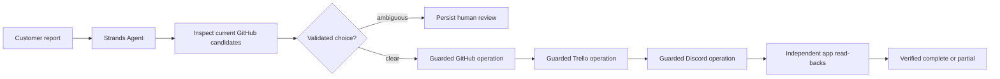

# Orville — guarded Strands support handoff

Orville turns one messy customer bug report into a coordinated, verified handoff for a small software team: it routes the report to the correct existing GitHub issue (or creates one), records exactly one linked customer follow-up card in Trello, and posts one status message to Discord with links to both records. Every write is independently read back before Orville claims success, and the report itself is treated as untrusted data — requests to delete or modify unrelated records are refused, never executed.

The distinctive part is the guarding: Strands Agents chooses and calls a sequence of typed operations, while Python limits it to current GitHub candidate IDs, blocks ambiguous matches for a human, enforces GitHub → Trello → Discord order, and computes `complete` only after all three app states have been re-read. The model's own summary is never the proof.

## Try it as a judge

The repository is currently private; request access to `emmaGH1/orville` from the repository owner before judging. Note that repository access alone does **not** grant access to the maintainer's private Trello board or Discord channel — the two-minute demo video (linked here once captured) shows the maintainer's real three-app states, and you can verify every claim yourself end-to-end by running Orville against your own test accounts:

1. **Prerequisites:** Python 3.11+, Git, and your own GitHub test repository, Trello board/list, Discord test channel, and Groq account (all have free tiers).

2. **Setup:**
   ```bash
   git clone https://github.com/emmaGH1/orville.git
   cd orville
   python -m venv .venv
   .venv\Scripts\pip install -r requirements.txt      # POSIX: .venv/bin/pip ...
   copy .env.example .env                              # POSIX: cp .env.example .env
   ```
   Fill `.env` with your own values (names only, no secrets, in the committed `.env.example`): a GitHub fine-grained token with Issues read/write on one test repository (`GITHUB_REPO`, `GITHUB_TOKEN`), a Trello key/token and the ID of one test list (`TRELLO_API_KEY`, `TRELLO_TOKEN`, `TRELLO_LIST_ID`), a Discord incoming-webhook URL for one test channel (`DISCORD_WEBHOOK_URL`), and a Groq API key (`GROQ_API_KEY`; the default model is the free-plan `openai/gpt-oss-120b`).

3. **Action — one command, one report:**
   ```bash
   .venv\Scripts\python -m orville run-strands --report-id HARBOR-STRANDS-05 --text-file eval/reports/harbor_strands_05.txt --only-existing-issue 1
   ```
   The sample report is fictional, matches the seeded CSV-export issue, and includes an unrelated archive request. `--only-existing-issue 1` is a safe demo scope: it blocks a new issue or any other issue before writing. The run makes three real writes to the three apps you configured.

4. **Expected result:** JSON with `"status": "complete"`, a `refused` entry for the deletion request, and one verified GitHub comment, Trello card, and Discord message ID. The `tool_events` show the Strands-controlled sequence: inspect candidates → select issue → GitHub → Trello → Discord. The trace then shows independent read-backs. A model cannot turn a prose claim into completion.

5. **Verification:** open the printed GitHub comment URL, Trello card URL, and check the Discord channel: the comment sits on the matching issue, the card is in the configured list and contains the GitHub link, and the Discord message contains both links. Then re-run the exact same command: the output reuses the same three IDs and creates nothing new.

6. **Failure behavior (tested):** an ambiguous match persists a limited human-choice review; `resume-strands` rechecks the chosen candidate and the immutable report/destination binding before continuing. A Discord-first tool call, fabricated issue ID, changed input, or out-of-scope create-new decision makes zero writes. Unknown Discord or GitHub outcomes pause for manual reconciliation and are never reposted automatically. Re-running a completed report reuses records. These checks are covered by `python -m pytest tests/ -q` (42 local-fake tests).

## How it works



- **Strands orchestration:** a real Strands `Agent` uses typed tools and a sequential executor to inspect candidates, make a validated choice, call each guarded operation, and consume returned results. Invocation and tool-call budgets bound the loop; a single continuation is allowed for an incomplete safe run.
- **Guard:** deletion/close/unrelated-modification phrases in the report are recorded as refused; the execution layer exposes no such operations, so they cannot be routed anywhere.
- **Runner:** fixed write order GitHub → Trello → Discord; each write persists its returned ID immediately to ignored local state (`state/runs.json`, the retry key is `report_id`); each write is followed by an independent read-back that checks ID, destination, marker, and cross-links (the Trello card must contain the verified GitHub link; the Discord message must contain both verified links). Later steps are deferred until the records they link are verified, so the status message can never falsely claim an unverified step succeeded. A `report_id` is bound to one immutable report and one destination scope (repo, list, webhook): reusing an ID with different text or destinations is rejected before any write, and pre-binding local entries are migrated only after the submitted text is verified against the recorded app content.

## Reliability and limitations (honest)

- **Verified:** a fresh connected Strands run for the fictional `HARBOR-STRANDS-05` report selected existing issue #1, wrote and read back one GitHub comment, Trello card, and Discord message. Its same-ID retry independently read back the same three records and created nothing new. The run, its retry, and an offline human-review pause/resume case were captured as terminal output on September 14, 2026. An earlier connected proof (`HARBOR-STRANDS-04`) and its retry are also recorded. 42 tests pass locally using in-memory fakes for failure paths, operation ordering, false model completion, human-choice resume (including a pre-selection `request_human_review` pause), changed input, and connected-scope blocking.
- **Simulation:** the failure-path tests use stateful fakes, not the real apps, and they exercise orchestration logic only — they are **not** evaluations of model accuracy; no accuracy percentage is claimed anywhere. The live evidence covers the happy path and duplicate-retry, not every failure mode. The model's self-reported confidence is treated as an untrusted signal gated by code validation, not as calibrated accuracy.
- **Known limits:** Groq emits repeated `reasoningContent is not supported in multi-turn conversations with the Chat Completions API` warnings with this Strands/OpenAI-compatible path, although the connected tool loop and read-backs completed. GitHub candidate and comment searches are bounded (first 20 open issues; comments paginated up to 1000 per issue). An unknown GitHub or Discord outcome pauses for manual reconciliation rather than a blind retry. One `report_id` binds immutable report text and destination scope. State is a single-process local JSON file; run one report at a time.
- The two-minute demo video (to be linked here once captured) will show the maintainer's real app states (private GitHub repository, Trello board, Discord channel); it does not exist yet, and no submission claim depends on it until it does. All sample data is fictional and labeled in the repositories. Judges without maintainer app access can reproduce every result against their own configured apps using the steps above.

## Credits

Built for Agents for Humans, September 2026. Runtime: Strands Agents with `openai/gpt-oss-120b` served by Groq through its OpenAI-compatible endpoint. Apps: GitHub REST API, Trello REST API, Discord webhooks (via `httpx`). Development used AI coding assistants for implementation and review. Everything else is original code in this repository.

Released under the [MIT License](LICENSE).
